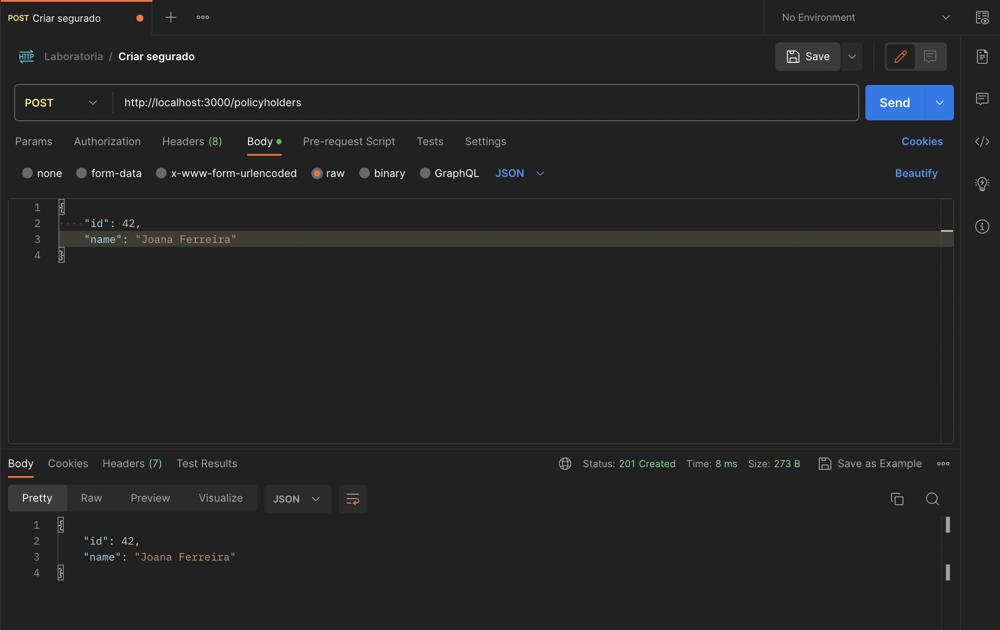
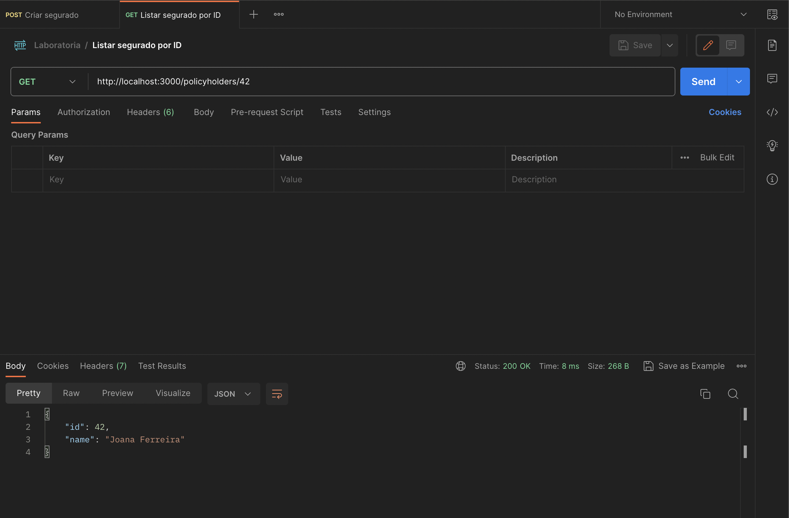

# Desafio Laboratória <> 180 Seguros

Bem-vinda ao desafio técnico da 180 Seguros em conjunto com a Laboratória! Esperamos que seja divertido e, caso você tenha qualquer dúvida, fique a vontade para entrar em contato com a gente :)

## Desafio

Você foi contratada pela 180! Durante a sua primeira reunião de planejamento semanal, decidimos em conjunto a sua primeira tarefa:

### LAB-001 - Criar o endpoint GET /policyholders/:policyholderId na API da 180

Os clientes da nossa seguradora estão pedindo uma nova rota, dentro do nossa API já existente, onde seja possível buscar um segurado, previamente cadastrado, utilizando o campo de ID.

Durante o refinamento técnico desta tarefa, decidimos que a nova rota teria o seguinte padrão: `/policyholders/:policyholderId`, onde o parâmetro `:policyholderId` representa o ID da pessoa segurada que está sendo buscada.

Por exemplo: supondo que o seguinte segurado já tenha sido cadastrado:

```json
{
  "id": 1,
  "name": "Maria Silva"
}
```

Ao chamar a rota `/policyholders/1`, devemos retornar estes mesmos dados no corpo da resposta, com o código HTTP 200:

```json
{
  "id": 1,
  "name": "Maria Silva"
}
```

Porém, caso o segurado ainda não tenha sido cadastrado (por exemplo: `/policyholders/99`), devemos retornar uma resposta com o código HTTP 404, indicando que o segurado não existe em nosso sistema. O corpo da resposta pode ser vazio, já que somente o código HTTP nos interessa para este desafio.

Resumindo, o que você precisa fazer:

- Criar o endpoint `GET /policyholders/:policyholderId`
  - Caso o segurado exista, retornar os dados do mesmo com o código HTTP 200
  - Caso o segurado não exista, retornar o código HTTP 404 e com o corpo (body) vazio.

## Rodando a API da 180 pela primeira vez

Para rodar a API da 180 em seu computador, você deve ter o [NodeJS](https://nodejs.org/) e o [NPM](https://www.npmjs.com/) instalados. Caso não tenha, consulte o seu material da Laboratoria para mais instruções.

Na pasta raiz do projeto, primeiro, vamos instalar as dependências:

```bash
npm install
```

Agora que as dependências do projeto estão instaladas, a nossa API está pronta para rodar! Podemos subir a aplicação através do comando:

```bash
npm start
```

Caso a mensagem `Desafio Laboratoria <> 180 Seguros rodando na porta 3000` seja exibida no seu terminal, você conseguiu subir a API com sucesso e temos a nossa aplicação rodando no endereço `http://localhost:3000`.

## Criando os primeiros segurados

Agora, você pode começar a criar alguns segurados que serão utilizados no desafio. Para isso, utilize o endpoint `POST /policyholders`, enviando o body, no formato JSON. Por exemplo:

```json
{
  "id": 42,
  "nome": "Joana Ferreira"
}
```

Podemos utilizar a ferramenta [Postman](https://www.postman.com/) para acessar os endpoints da API. Faça o download da ferramenta [aqui neste link](https://www.postman.com/downloads/) e cadastre-se para acessar o software.

Abaixo temos um print com um exemplo de chamada para a rota de criar segurados:



## Testando o seu endpoint

Você também pode utilizar o Postman para acessar a rota do seu desafio:



Ao final do desafio, a sua resposta do Postman deve estar semelhante a imagem acima.

**IMPORTANTE**: Não se esqueça que toda vez que você alterar o código, deve subir a aplicação novamente, ok? E, como o nosso "banco de dados" está em memória, ao subir a aplicação, você terá que cadastrar os segurados novamente.

## Entrando em detalhes da API 180

O código do projeto está na pasta `src/` e possui 3 arquivos ou camadas:

- `app.js`: Ponto de entrada da aplicação. Aqui são feitas todas as configurações da nossa API, definições das rotas e é onde subimos a aplicação. A rota do desafio `/policyholders/:policyholderId` já está criada aqui.
- `controller.js`: Responsável por juntar e orquestrar o código da API. As rotas chamam as funções do controller e é dentro delas em que ocorrem validações, chamadas para a camada do banco de dados, definição de respostas, entre outras coisas. A função principal do desafio `getPolicyholderById` também já está criada mas ainda não está implementada. É aqui em que grande parte do desafio vai se passar.
- `db.js`: Camada de acesso ao "banco de dados". No nosso desafio, não estamos utilizando um banco de dados real porém, estamos simulando o seu funcionamento através de variáveis em memória. É possível que a função do desafio também já exista mas descobrir fica como parte do desafio :)

O projeto utiliza somente 2 dependências:

- [express](https://expressjs.com/): servidor HTTP.
- [express-validator](https://express-validator.github.io/docs/): biblioteca que ajuda a validar os dados recebidos nas rotas da API. Uso `opcional` no desafio.

Temos as seguintes rotas já implementadas para que você possa utilizar durante o desafio:

- `GET /policyholders`: Retorna todos os segurados cadastrados, em um array.
- `POST /policyholders`: Cadastra um novo segurado.

## Orientações

- Você pode utilizar as rotas já existentes `POST /policyholders` e `GET /policyholders` para cadastrar e visualizar os segurados existentes, respectivamente. Após cadastrar um segurado, você já pode testar o seu novo endpoint `GET /policyholders` com o ID do segurado cadastrado.
- O projeto utiliza a biblioteca [express-validator](https://express-validator.github.io/docs/), que ajuda bastante na criação de validações mas seu uso no desafio é totalmente opcional. É possível resolver o desafio sem utilizá-la.
- Lembrando que, para acessar algum endpoint da API, devemos sempre juntar o endereço em que a aplicação está rodando + a rota. Por exemplo, para acessar a rota `GET /policyholders/1`, no Postman, devemos colocar na URL o valor `http://localhost:3000/policyholders/1` e o método `GET`.
- A documentação oficial do projeto é sempre a sua melhor amiga. Na documentação do [Express](https://expressjs.com/en/starter/hello-world.html) temos vários exemplos que podem te ajudar. [Nesta página](https://expressjs.com/en/guide/routing.html), por exemplo, temos a explicação de como pegar os `Route parameters`, que será essencial no nosso desafio.
- As outras rotas já existentes estão aí pra te ajudar! Você pode roubar algumas ideias que estão em outras funções, se você quiser :)
